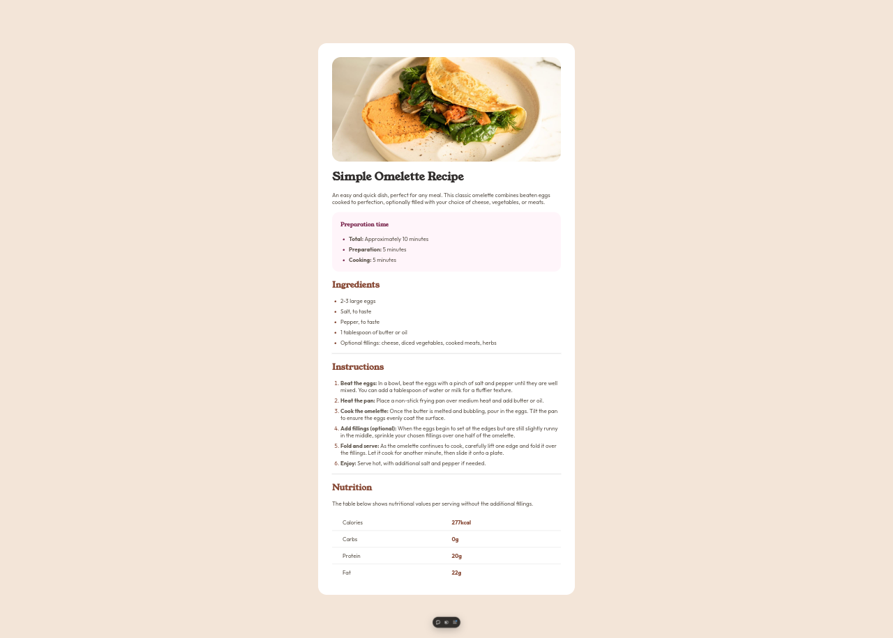

# Frontend Mentor - Recipe page

Este repositório contém soluções para desafios de desenvolvimento frontend oferecidos pelo [Frontend Mentor](https://www.frontendmentor.io/). Os desafios abordam diferentes níveis de complexidade e proporcionam a oportunidade de desenvolver habilidades em HTML, CSS e JavaScript, além de práticas com responsividade, layout, acessibilidade e otimização.

## Visualização

Todas as soluções estão hospedadas na Vercel para fácil visualização. Confira o link abaixo para ver o projeto ao vivo:

🔗 [Ver Desafio no Vercel](https://frontendmentor-recipe-page-delta.vercel.app/)

## Desafios incluídos

Cada desafio está organizado em uma pasta com os arquivos necessários, incluindo HTML, CSS, JavaScript e imagens fornecidas pelo Frontend Mentor. A estrutura do código segue boas práticas de desenvolvimento para facilitar a leitura, manutenção e escalabilidade.

## Objetivo

O objetivo deste repositório é aprender e aprimorar as seguintes habilidades:

- **HTML5 Semântico**: Estruturação adequada para melhorar a acessibilidade e otimizar SEO.
- **CSS e Layout Responsivo**: Uso de Flexbox, Grid e Media Queries para designs responsivos e estéticos.
- **JavaScript**: Aplicação de funcionalidades interativas para tornar a interface mais dinâmica.
- **Controle de Versão com Git**: Organização e registro de progresso e aprimoramentos.
- **Boas Práticas de Desenvolvimento**: Manutenção de código limpo, comentado e seguindo uma estrutura padronizada.

